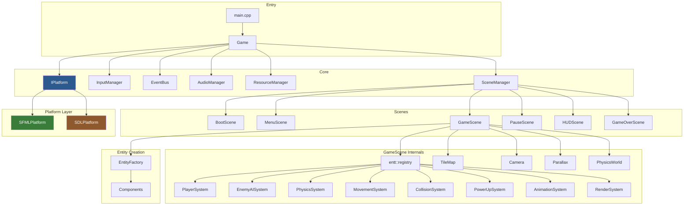

# Architecture

Technical architecture document for **Ruins of the Ancients**.

---

## System Overview



---

## Frame Data Flow

Every frame follows this exact sequence inside `Game::tick()`:

```
1. Platform.pollEvents()
   └── OS events → internal key state arrays

2. InputManager.update()
   └── Raw keys → Action states (merge keyboard + touch, filter conflicts)

3. Fixed Timestep Loop (accumulator pattern, 1/60s chunks):
   │
   ├── SceneManager.handleInput(InputManager)
   │   └── Active scene reads actions (e.g. GameScene checks Pause)
   │
   ├── SceneManager.update(dt)
   │   └── Active scene ticks all systems in order:
   │       │
   │       ├── PlayerSystem
   │       │   └── Reads input → updates state machine → sets velocity
   │       │       (coyote time, jump buffer, dash, wall jump)
   │       │
   │       ├── EnemyAISystem
   │       │   └── Patrol/chase/shoot logic → sets velocity + state
   │       │
   │       ├── PhysicsSystem
   │       │   └── Gravity → velocity, terminal velocity cap
   │       │       Wall-slide reduced gravity, dash zero-gravity
   │       │
   │       ├── MovementSystem
   │       │   └── Position += velocity * dt
   │       │
   │       ├── CollisionSystem
   │       │   └── Spatial hash broad phase → AABB narrow phase
   │       │       Static resolution (push out of walls, set grounded)
   │       │       Dynamic pairs (stomp, hurt, pickup, goal, projectile)
   │       │       Probe-based ground/wall detection
   │       │       DestroyFlag cleanup
   │       │
   │       ├── PowerUpSystem
   │       │   └── Duration countdown, effect application, expiry cleanup
   │       │
   │       └── AnimationSystem
   │           └── State → clip mapping, frame advance, blink effect
   │
   └── AudioManager.update(dt)
       └── Music fade interpolation

4. SceneManager.applyPendingCommands()
   └── Deferred push/pop/replace applied (safe, no mid-frame mutation)

5. Platform.clear() → SceneManager.render() → Platform.display()
   └── Bottom-up scene rendering (transparent scenes show those below)
       Parallax → TileMap → RenderSystem (z-sorted entities)
```

---

## Platform Abstraction Layer

### Problem

SFML does not support WebAssembly. SDL2 does (via Emscripten ports). We need both.

### Solution

All game code depends on `IPlatform` — a pure virtual interface defining every render, input, audio, and resource operation. Two concrete implementations exist:

| Implementation | Backend | When Used |
|---------------|---------|-----------|
| `SFMLPlatform` | SFML 2.6 | Native builds (Windows, Linux, macOS) |
| `SDLPlatform` | SDL2 + SDL_image + SDL_ttf + SDL_mixer | WASM builds (Emscripten) |

Selection is compile-time via `#ifdef MARIO_WASM` in `PlatformFactory.hpp`. The factory uses forward-declared creation functions — platform headers are never included in game code.

### Key Design Rules

1. **Game code never includes SFML or SDL headers** — only `IPlatform.hpp`
2. **Resources are opaque handles** — `TextureHandle{uint32_t}`, `SoundHandle{uint32_t}`, `FontHandle{uint32_t}`. The platform resolves handles internally.
3. **Camera offset is platform-managed** — `setCameraOffset()` is called once per frame, platform subtracts offset from all draw positions automatically
4. **Touch input bridges via exported C function** — WASM web shell calls `setTouchInput()` which maps to `InputManager::setTouchButtonState()`

---

## ECS Design

### Why EnTT

- **Cache-friendly iteration** — components are stored in contiguous arrays per type, not scattered across entity objects
- **Zero-overhead views** — `reg.view<A, B>()` iterates only entities that have both components, with no virtual dispatch
- **Header-only** — no build complexity, fetched via CMake FetchContent
- **Mature and battle-tested** — widely used in game development

### Component Design

Components are plain-old-data structs with no methods (except trivial helpers like `ColliderComponent::toRect()`). No inheritance, no virtual functions. This keeps cache lines dense.

20 component types cover all game state:

| Category | Components |
|----------|-----------|
| Spatial | Transform, Velocity, Gravity |
| Collision | Collider |
| Rendering | Sprite, Animation |
| Gameplay | Player, Enemy, Health, Projectile, Collectible, PowerUp, Destructible, Goal |
| Audio | AudioTrigger |
| Metadata | Tag, DestroyFlag |
| Effects | ParticleEmitter |

### System Processing Order

The order matters. Each system reads state set by previous systems:

1. **PlayerSystem** — reads input, writes velocity + state
2. **EnemyAISystem** — reads player position, writes enemy velocity + state
3. **PhysicsSystem** — reads gravity components, writes velocity (applies gravity)
4. **MovementSystem** — reads velocity, writes position
5. **CollisionSystem** — reads position + collider, writes position (resolution) + flags
6. **PowerUpSystem** — reads timers, writes effects
7. **AnimationSystem** — reads state, writes sprite source rects
8. **RenderSystem** — reads sprite + transform, draws to platform

### Entity Destruction

Entities are never destroyed mid-iteration. Instead:
1. System marks entity with `DestroyFlag` (empty tag component)
2. `CollisionSystem::update()` batch-destroys all flagged entities at end of frame

---

## Scene Management

Scenes are managed via a **stack** with **deferred commands**:

```
Stack (top = active):
┌──────────────┐
│  PauseScene  │  ← handles input, blocks below
├──────────────┤
│   HUDScene   │  ← transparent, draws over GameScene
├──────────────┤
│  GameScene   │  ← transparent scenes above show this
└──────────────┘
```

Commands (`push`, `pop`, `replace`) are queued as `std::variant` entries and applied at end-of-frame via `applyPendingCommands()`. This prevents stack mutation during iteration.

Transparent scenes (`isTransparent() = true`) cause the scene manager to render all scenes below them too, creating overlay effects (HUD, pause dimming, game over).

---

## Security Measures

### SafeFileIO

All file reads go through `SafeIO::readFile()` which:
- Rejects paths containing `..`
- Rejects absolute paths
- Canonicalizes the resolved path and verifies it starts with the configured root
- Returns `std::nullopt` on any validation failure — never throws

### No Raw Pointers to Owned Resources

- Platform is owned by `Game` via `std::unique_ptr<IPlatform>`
- Resources are tracked by opaque integer handles, not raw pointers
- Scene ownership is via `std::unique_ptr<IScene>` in the scene stack
- Event subscribers are tracked by `SubscriberID` for clean unsubscription

### Input Validation

- `InputManager` filters simultaneous Left+Right to neither (no contradictory input)
- `setTouchInput()` validates action ID range before dispatching
- `LevelLoader` validates all JSON fields, bounds-checks tile coordinates, and catches parse exceptions

### WASM Sandbox

- Emscripten runs in a browser sandbox — no filesystem access beyond preloaded assets
- `SAFE_HEAP=1` and `ASSERTIONS=1` enabled in debug WASM builds
- Memory growth is allowed but initial allocation is 64MB
- No network calls, no eval, no dynamic code generation

### Arcade Rules

- Zero file writes during gameplay — score, lives, coins are RAM-only
- Game over resets everything — no persistence between sessions
- No save/load system — eliminates an entire class of serialization vulnerabilities
